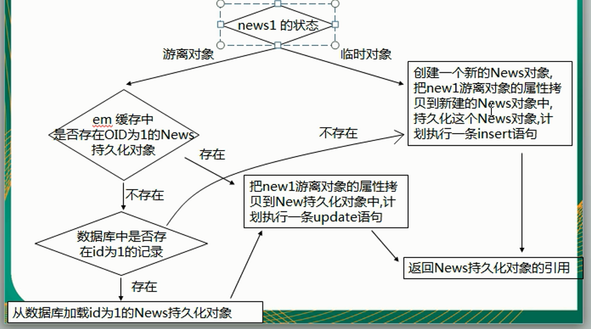

# JPA

## JPA概述

- JPA（Java Persistence API）：用于对象持久化的API。
- Java EE 5.0平台标准的ORM规范，使得应用程序以统一的方式访问持久层。

### JPA和Hibernate的关系

- JPA是hibernate的一个抽象。
  - JPA是一种ORM规范。
  - Hibernate是JPA实现。
- JPA是Hibernate功能的子集。

### JPA的供应商

- Hibernate
- OpenJPA
- TopLink

### JPA的优势

- 标准化
- 简单易用，集成方便
- 可媲美JDBC的查询能力（JPQL）
- 支持面向对象的高级特性

### JPA三方面技术

- ORM映射元数据
- JPA的API
- 查询语言（JPQL）

## JPA HelloWorld

- 创建`persistence.xml`配置文件，在这个配置文件中配置持久化单元
  - 需要跟哪个数据库进行交互
  - 需要制定JPA使用哪个持久化框架以及配置该框架的基本属性
- 创建实体类，使用`annotation`来描述实体类跟数据库之间的映射关系
- 使用JPA API完成数据增删改查
  - 创建`EntityManagerFactory`
  - 创建`EntityManager`

### 创建persistence.xml配置文件

- JPA规范要求在类路径的`META-INF`目录下放置`persistence.xml`，文件的名称是固定的。

```xml
<?xml version="1.0" encoding="UTF-8"?>
<persistence xmlns="http://java.sun.com/xml/ns/persistence" version="2.0">
    <persistence-unit name="NewPersistenceUnit">
        <!-- 配置使用什么ORM产品来作为JPA的实现
            1. 实际上配置的是javax.persistence.spi.PersistenceProvider 接口的实现类
            2. 若JPA项目中只有一个JPA的实现产品，则也可以不配置该节点。
        -->
        <provider>org.hibernate.ejb.HibernatePersistence</provider>
        <properties>

            <!-- 配置连接数据库的基本信息 -->
            <property name="javax.persistence.jdbc.driver" value="com.mysql.jdbc.Driver"/>
            <property name="javax.persistence.jdbc.url" value="jdbc:mysql://192.168.8.129/jpa"/>
            <property name="javax.persistence.jdbc.user" value="root"/>
            <property name="javax.persistence.jdbc.password" value="123456"/>

            <!-- 配置JPA 实现产品的基本属性，配置Hibernate的基本属性 -->
            <property name="hibernate.format_sql" value="true"/>
            <property name="hibernate.show_sql" value="true"/>
            <property name="hibernate.hbm2ddl.auto" value="update"/>
        </properties>
    </persistence-unit>
</persistence>
```

### 创建实体类

```java
package com.devinkin.jpa.helloworld;

import javax.persistence.*;

@Table(name = "JPA_CUSTOMERS")
@Entity
public class Customer {
    private Integer id;
    private String lastName;
    private String email;
    private int age;

    @Column(name = "ID")
    @GeneratedValue(strategy = GenerationType.AUTO)
    @Id
    public Integer getId() {
        return id;
    }

    public void setId(Integer id) {
        this.id = id;
    }

    @Column(name = "LAST_NAME")
    public String getLastName() {
        return lastName;
    }

    public void setLastName(String lastName) {
        this.lastName = lastName;
    }

    public String getEmail() {
        return email;
    }

    public void setEmail(String email) {
        this.email = email;
    }

    public int getAge() {
        return age;
    }

    public void setAge(int age) {
        this.age = age;
    }
}
```

### 使用JPA API完成数据增删改查

```java
package com.devinkin.jpa.helloworld;

import javax.persistence.EntityManager;
import javax.persistence.EntityManagerFactory;
import javax.persistence.EntityTransaction;
import javax.persistence.Persistence;

public class Main {
    public static void main(String[] args) {
        // 1. 创建 EntitymanagerFactory
        EntityManagerFactory entityManagerFactory =
                Persistence.createEntityManagerFactory("jpa-1");
        // 2. 创建 EntityManager
        EntityManager entityManager = entityManagerFactory.createEntityManager();
        // 3. 开启事务
        EntityTransaction transaction = entityManager.getTransaction();
        transaction.begin();
        // 4. 进行持久化操作
        Customer customer = new Customer();
        customer.setAge(12);
        customer.setEmail("devinkinwork@163.com");
        customer.setLastName("devinkin");
        entityManager.persist(customer);
        // 5. 提交事务
        transaction.commit();
        // 6. 关闭 EntityManager
        entityManager.close();
        // 7. 关闭 EntitymanagerFactory
        entityManagerFactory.close();
    }
}
```

## JPA基本注解

- JPA的基本注解有
  - `@Entity`
  - `@Transient`
  - `@Temporal`
  - `@Table`
  - `@id`
  - `@GenerateValue`
  - `@Column`
  - `@Basic`

### @Entity

- `@Entity`标注用于实体类声明语句之前，==指出该Java类为实体类，将映射到指定的数据库表==。

### @Table

- 当实体类与其他映射的数据库表名不同名时，需要使用`@Table`注解说明。
- 该注解与`@Entity`标注并列使用，置于实体类声明语句之前，可写于单独语句行，也可与声明语句同行。

- `@Table`注解的常用选项是name，用于指明数据库的表名。
- `@Table`注解的其他选项
  - `catalog`用于设置表所属的数据库目录，通常为数据库名。
  - `schema`用于设置表所属的数据库模式，通常为数据库名。
  - `uniqueConstrains`用于设置约束条件。

### @Id

- `@Id`标注用于声明一个实体类的属性映射为数据库的主键列。
- 该属性通常置于属性声明语句之前，可与声明语句同行，也可写在单独行上。
- `@Id`标注也可以置于属性的getter方法之前。

### @GeneratedValue

- `@GeneratedValue`用于标注主键的生成策略，通过strategy属性指定。默认情况下，JPA自动选择一个最合适底层数据库的主键生成策略。
- `javax.persistence.GenerationType`定义的主键生成策略
  - `IDENTITY`采用数据库ID自增长方式来生成主键，Oracle不支持。
  - `AUTO`JPA自动选择合适的策略，默认选项。
  - `SEQUENCE`通过序列产生主键，通过`@SequenceGenerator`注解指定序列名，MySQL不支持这种方式
  - `TABLE`通过表产生主键，框架借由表模拟序列产生主键，使用该策略可以使应用更易于数据库迁移。

### @Basic

- `@Basic`表示一个简单的属性到数据库表的字段的映射，对于==没有任何标注的`getXxx()`方法，默认即为`@Basic`==
- `fetch`表示属性的读取策略
  - `EAGER`表示主支抓取，默认为EAGER。
  - `LAZY`表示延迟加载。
- `option`表示该属性是否允许为null，默认为true。

### @Column

- 当实体类的属性与其映射的数据库表的列不同名时需要使用`@Column`注解说明。
- `@Column`常用属性是name，用于设置映射数据库表的列名。其他属性如下
  - `unique`
  - `nullable`
  - `length`
- `@Column`的`columnDefinition`属性，表示该字段在数据库中的实际类型。

### @Transient

- 表示该属性并非一个到数据库表的字段的映射，ORM框架将忽略该属性。
- 如果一个属性并发数据库表的字段映射，就务必将其标注为`@Transient`，否则ORM框架默认认为其注解为`@Basic`

### @Temporal

- 在进行属性映射时可以使用，`@Temporal`注解用来调整时间日期精度。

## 用@TableGenerator来生成主键详解

- 当前主键的值单独保存到一个数据库的表中，主键的值每次都是从指定的表中查询来获得的。
- 这种方法生成主键的策略可以适用于任何数据库，不必担心数据库不兼容问题。
- `@TableGenerator`属性说明
  - `name`表示主键生成的名称，它被引用在`@GeneratedValue`中设置的generator值中。
  - `table`表示生成策略所持久化的表名。
  - `pkColumnName`属性表示在持久化表中，该主键生成策略所对应键值的名称。
  - `valueColumnName`属性的值表示在持久化表中，该主键当前所生成的值，它的值将会随着每次创建累加。
  - `pkColumnValue`属性的值表示在持久化表中，该生成策略所对应的主键。
  - `allocationSize`表示每次主键增加的大小，默认值为50。

```java
@TableGenerator(name = "ID_GENERATOR",
                table="JPA_ID_GENERATORS",
                pkColumnName = "PK_NAME",
                pkColumnValue = "CUSTOMER_ID",
                valueColumnName = "PK_VALUE",
                allocationSize = 100)
@GeneratedValue(strategy = GenerationType.TABLE, generator = "ID_GENERATOR")
@Id
public Integer getId() {
    return id;
}
```

## JPA API

### Persistence

- Persistence类是用于获取`EntityManagerFactory`实例，该类包含一个名为`createEntityManagerFactory`的静态方法。
- 重载版本
  - `createEntityManagerFactory(String persistenceUnitName, Map properties)`
  - `createEntityManagerFactory(String persistenceUnitName)`
  - String参数是以JPA配置文件`persistence.xml`中的持久化单元名`<persistence-unit>`为参数。
  - Map用于设置JPA的相关属性。

### EntityManagerFactory

- EntityManagerFactory接口主要用来创建EntityManager的实例。
- EntityManagerFactory的4个方法
  - `createEntityManager()`创建实体管理器对象实例。
  - `createEntityManager(Map map)`创建实体管理器对象实例，map参数提供EntityManager的配置。
  - `isOpen()`检查EntityManagerFactory是否处于打开状态。
  - `close()`关闭EntityManagerFactory。

### EntityManager4个基本方法

- EntityManager是完成持久化操作的核心对象。
- JPA实体的状态
  - 新建状态：新建的对象，==尚未拥有持久化性主键==。
  - 持久化状态：已经拥有持久性键并==和持久化建立了上下文环境==。
  - 游离状态：==拥有持久化键，但没有与持久化建立上下文环境。==
  - 删除状态：拥有持久化键，已经和持久化建立上下文环境，但是==从数据库中删除==。

- EntityManager有4个方法

  - `find(Class<T>, Object)`类似hibernate的get方法。
  - `getReference(Class<T>, Object)`类似hibernate的load方法，有延迟加载（返回代理对象，只有在对象被使用的情况下才会执行查询）。
  - `persistence(Class<T>, Object)`使对象由临时状态变为持久化状态。若对象有id，则不能执行insert操作，否则会抛出异常。
  - `remove(Class<T>, Object)`该方法只能移除持久化对象，不能移除游离对象（从数据库中查出再remove）。

- 使用示例

  ```java
  package com.devinkin.jpa.test;
  
  import com.devinkin.jpa.helloworld.Customer;
  import org.junit.After;
  import org.junit.Before;
  import org.junit.Test;
  
  import javax.persistence.EntityManager;
  import javax.persistence.EntityManagerFactory;
  import javax.persistence.EntityTransaction;
  import javax.persistence.Persistence;
  import java.util.Date;
  
  public class JPATest {
      private EntityManagerFactory entityManagerFactory;
      private EntityManager entityManager;
      private EntityTransaction transaction;
  
      @Before
      public void initial() {
          entityManagerFactory = Persistence.createEntityManagerFactory("jpa-1");
          entityManager = entityManagerFactory.createEntityManager();
          transaction = entityManager.getTransaction();
          transaction.begin();
      }
  
      // 类似于hibernate中Session的get方法
      @Test
      public void testFind() {
          Customer customer = entityManager.find(Customer.class, 1);
          System.out.println("------------------------------------------");
          System.out.println(customer);
      }
  
      // 类似于hibernate中的load方法
      @Test
      public void testGetReference() {
          Customer customer = entityManager.getReference(Customer.class, 1);
          System.out.println(customer.getClass().getName());
          System.out.println("------------------------------------------");
          System.out.println(customer);
      }
  
      // 类似于hibernate的save方法，使对象由临时状态变为持久化状态
      @Test
      public void testPersistence() {
          Customer customer = new Customer();
          customer.setAge(15);
          customer.setBirth(new Date());
          customer.setCreatedTime(new Date());
          customer.setEmail("devinkin@163.com");
          customer.setLastName("lala");
          customer.setId(100);
          entityManager.persist(customer);
  
          System.out.println(customer.getId());
      }
  
      // 类似于hibernate的delete方法，把对象的记录从数据库中移除
      // 该方法只能移除持久化对象，而hibernate的delete方法实际上还可以移除游离对象
      @Test
      public void testRemove() {
  //        Customer customer = new Customer();
  //        customer.setId(2);
          Customer customer = entityManager.find(Customer.class, 2);
          entityManager.remove(customer);
      }
  
      @After
      public void destory() {
          transaction.commit();
          entityManager.close();
          entityManagerFactory.close();
      }
  }
  ```

### EntityManager#merge方法

- `merge(T entity)`：merge方法用于处理Entity的同步，即数据库的插入和更新操作。

  

- 使用示例

  ```java
  // 类似于hibernate Session的saveOrUpdate方法。
  @Test
  public void testMerge1() {
      // 1. 若传入的是临时对象
      // 会创建一个新的对象，吧临时对象的属性复制到新的对象中，然后对新的对象执行持久化操作
      // 新的对象中有id，但以前的临时对象中没有id
      Customer customer = new Customer();
      customer.setAge(18);
      customer.setBirth(new Date());
      customer.setCreatedTime(new Date());
      customer.setEmail("cc@163.com");
      customer.setLastName("CC");
  
      Customer customer1 = entityManager.merge(customer);
      System.out.println("customer#id: " + customer.getId());
      System.out.println("customer1#id: " + customer1.getId());
  }
  
  // 若传入的是一个游离对象，即传入的对象由OID。
  // 1. 若在EntityManager缓存中没有该对象
  // 2. 若在数据库中也没有对应的记录
  // 3. JPA会创建一个新的对象，然后把当前游离对象的属性复制到新创建的对象中
  // 4. 对新创建的对象执行insert操作
  @Test
  public void testMerge2() {
      Customer customer = new Customer();
      customer.setAge(18);
      customer.setBirth(new Date());
      customer.setCreatedTime(new Date());
      customer.setEmail("dd@163.com");
      customer.setLastName("DD");
  
      customer.setId(100);
  
      Customer customer1 = entityManager.merge(customer);
      System.out.println("customer#id: " + customer.getId());
      System.out.println("customer2#id: " + customer1.getId());
  }
  
  // 若传入的是一个游离对象，即传入的对象由OID。
  // 1. 若在EntityManager缓存中没有该对象
  // 2. 若在数据库中有对应的记录
  // 3. JPA会查询对应的记录，然后返回该记录对应的对象，然后会把游离对象的属性复制到查询到的持久化对象中
  // 4. 对查询得到的持久化象执行update操作
  @Test
  public void testMerge3() {
      Customer customer = new Customer();
      customer.setAge(18);
      customer.setBirth(new Date());
      customer.setCreatedTime(new Date());
      customer.setEmail("ee@163.com");
      customer.setLastName("EE");
  
      customer.setId(4);
  
      Customer customer1 = entityManager.merge(customer);
      System.out.println(customer == customer1);
  }
  
  // 若传入的是一个游离对象，即传入的对象由OID。
  // 1. 若在EntityManager缓存中有该对象
  // 2. JPA会把游离对象的属性复制到EntityManager缓存中的对象。
  // 3. EntityManager缓存中的对象执行UPDATE
  @Test
  public void testMerge4() {
      Customer customer = new Customer();
      customer.setAge(18);
      customer.setBirth(new Date());
      customer.setCreatedTime(new Date());
      customer.setEmail("ff@163.com");
      customer.setLastName("FF");
  
      customer.setId(4);
  
      Customer customer1 = entityManager.find(Customer.class, 4);
      entityManager.merge(customer);
  
      // false
      System.out.println(customer == customer1);
  }
  ```

### EntityManager的其他方法

- `refresh(Object entity)`用数据库实体记录的值更新实体对象的状态，即更新实例的属性值。
- `clear()`清除持久上下文环境，断开一切所有关联的实体。如果这时还有未提交的更新则会被撤销。
- `contains(Object entity)`判断一个实例是否属于当前持久上下文环境管理的实体。
- `isOpen()`判断当前实例管理器是否是打开状态。
- `getTransaction()`返回资源层的事务对象。EntityTransaction实例可以用于开始和提交多个事务。
- `close()`关闭实体管理器。
- `flush()`同步持久上下文环境，即将持久上下文环境的所有未保存实体的状态信息保存到数据库中。
- `setFlushMode(FlushModeType flushMode)`设置持久上下文环境的Flush模式。参数可以取2个枚举。
  - `FlushModeType.AUTO`为自动更新数据库实体。
  - `FlushModeType.COMMIT`为直到提交事务时才更新数据库记录。
- `getFlushMode()`获取持久上下文环境的Flush模式，返回FlushModeType类的枚举值。

### EntityTransaction

- EntityTransaction接口用来管理资源层实体管理器的事务操作。通过实体管理器的`getTransaction`方法获得其实例。
- EntityTransaction常用方法
  - `begin()`启动一个事务。
  - `commit()`提交一个事务。
  - `rollback()`回滚当前事务。
  - `setRollbackOnly()`使当前事务只能被回滚。
  - `getRollbackOnly()`查看当前事务是否设置了只能回滚标志。

## 映射关联关系

- 映射==单向多对一==关联关系
- 映射==单向一对多==关联关系
- 映射==双向多对一==关联关系
- 映射==双向一对一==关联关系
- 映射==双向多对多==关联关系

### 映射单向多对一关联关系

- 使用`@ManyToOne`来映射多对一的关联关系。

- 使用`@JoinColumn`来映射外键。

- 可以使用`@ManyToOne`的fetch属性，来修改默认的关联属性的加载策略。

- 测试示例

  ```java
  package com.devinkin.jpa.test;
  
  import com.devinkin.jpa.helloworld.Customer;
  import com.devinkin.jpa.helloworld.Order;
  import org.junit.After;
  import org.junit.Before;
  import org.junit.Test;
  
  import javax.persistence.*;
  import java.util.Date;
  
  public class JPATestMapping {
      private EntityManagerFactory entityManagerFactory;
      private EntityManager entityManager;
      private EntityTransaction transaction;
  
      @Before
      public void initial() {
          entityManagerFactory = Persistence.createEntityManagerFactory("jpa-1");
          entityManager = entityManagerFactory.createEntityManager();
          transaction = entityManager.getTransaction();
          transaction.begin();
      }
  
      /**
       * 保存多对一时，建议先保存1的一端，后保存n的一端，这样不会多出额外的UPDATE语句。
       */
      @Test
      public void testManyToOnePersist() {
          Customer customer = new Customer();
          customer.setAge(15);
          customer.setBirth(new Date());
          customer.setCreatedTime(new Date());
          customer.setEmail("hh@163.com");
          customer.setLastName("GG");
  
          Order order1 = new Order();
          order1.setOrderName("H-HH-1");
          Order order2 = new Order();
          order2.setOrderName("H-HH-2");
          Order order3 = new Order();
          order3.setOrderName("H-HH-3");
  
          // 设置关联关系
          order1.setCustomer(customer);
          order2.setCustomer(customer);
          order3.setCustomer(customer);
  
          // 执行保存操作
  //        entityManager.persist(customer);
          entityManager.persist(order1);
          entityManager.persist(order2);
          entityManager.persist(order3);
          entityManager.persist(customer);
      }
  
  
      // 默认情况下，使用左外连接的方式获取n的一端的对象和其关联的1的一端的对象
      // 可以使用@ManyToOne的fetch属性，来修改默认的关联属性的加载策略
      @Test
      public void testManyToOneFind() {
          Order order = entityManager.find(Order.class, 1);
          System.out.println(order.getOrderName());
          System.out.println(order.getCustomer().getLastName());
      }
  
      @Test
      public void testManyToOneRemove() {
          // 删除n端
  //        Order order = entityManager.find(Order.class, 1);
  //        entityManager.remove(order);
          // 不能直接删除1都端，因为有外键约束
          Customer customer = entityManager.find(Customer.class, 7);
          entityManager.remove(customer);
      }
  
      @Test
      public void testManyToOneUpdate() {
          Order order = entityManager.find(Order.class, 2);
          order.getCustomer().setLastName("FFF");
      }
      
      @After
      public void destory() {
          transaction.commit();
          entityManager.close();
          entityManagerFactory.close();
      }
  }
  ```

### 映射单向一对多关联关系

- 使用`@OneToMany`来映射多对一的关联关系。

- 使用`@JoinColumn`来映射外键。

- 可以通过`@OneToMany`的fetch属性来修改默认的加载策略。

- 使用示例

  ```java
  package com.devinkin.jpa.test;
  
  import com.devinkin.jpa.helloworld.Customer;
  import com.devinkin.jpa.helloworld.Order;
  import com.devinkin.jpa.helloworld.Order2;
  import org.junit.After;
  import org.junit.Before;
  import org.junit.Test;
  
  import javax.persistence.*;
  import java.util.Date;
  
  public class JPATestMapping {
      private EntityManagerFactory entityManagerFactory;
      private EntityManager entityManager;
      private EntityTransaction transaction;
  
      @Before
      public void initial() {
          entityManagerFactory = Persistence.createEntityManagerFactory("jpa-1");
          entityManager = entityManagerFactory.createEntityManager();
          transaction = entityManager.getTransaction();
          transaction.begin();
      }
  
      // 单向1-n关联关系执行保存时，一定会多出update语句。
      // 因为n一端在插入时不会同时插入外键列
      @Test
      public void testOneToManyPersist() {
          Customer customer = new Customer();
          customer.setAge(15);
          customer.setBirth(new Date());
          customer.setCreatedTime(new Date());
          customer.setEmail("oo@163.com");
          customer.setLastName("OO");
  
          Order2 order1 = new Order2();
          order1.setOrderName("O-OO-1");
          Order2 order2 = new Order2();
          order2.setOrderName("O-OO-2");
          Order2 order3 = new Order2();
          order3.setOrderName("O-OO-3");
  
          // 建立挂链关系
          customer.getOrders().add(order1);
          customer.getOrders().add(order2);
          customer.getOrders().add(order3);
  
          // 执行保存操作
          entityManager.persist(customer);
          entityManager.persist(order1);
          entityManager.persist(order2);
          entityManager.persist(order3);
      }
  
      // 默认对多的乙方使用懒加载的加载策略
      @Test
      public void testOneToManyFind() {
          Customer customer = entityManager.find(Customer.class, 9);
          System.out.println(customer.getLastName());
          System.out.println(customer.getOrders().size());
      }
  
  
      // 默认情况下，若删除1的一端，则会先把关联的n的一端的外键置空，然后进行删除
      // 可以通过@OneToMany的fetch属性来修改默认的加载策略
      @Test
      public void testOneToManyRemove() {
          Customer customer = entityManager.find(Customer.class, 8);
          entityManager.remove(customer);
      }
  
  
      @Test
      public void testOneToManyUpdate() {
          Customer customer = entityManager.find(Customer.class, 10);
          customer.getOrders().iterator().next().setOrderName("O-XXX-10");
      }
  
      @After
      public void destory() {
          transaction.commit();
          entityManager.close();
          entityManagerFactory.close();
      }
  }
  ```

### 映射双向多对一关联关系

- 若先保存1的一端，则会多出n条UPDATE语句。

- 在进行双向1-n关联关系时，建议使用n的一方来维护关联关系。

- 可以使用`@OneToMany`的`mappedBy = "customer"`属性在1端放弃外键的维护，此时也要去掉`@JoinColumn`注解标注。

- 使用示例

  ```java
  @Test
  public void testManyToOnePersist() {
      Customer customer = new Customer();
      customer.setAge(15);
      customer.setBirth(new Date());
      customer.setCreatedTime(new Date());
      customer.setEmail("hh@163.com");
      customer.setLastName("GG");
  
      Order order1 = new Order();
      order1.setOrderName("H-HH-1");
      Order order2 = new Order();
      order2.setOrderName("H-HH-2");
      Order order3 = new Order();
      order3.setOrderName("H-HH-3");
      customer.getOrders().add(order1);
      customer.getOrders().add(order2);
      customer.getOrders().add(order3);
  
      // 设置关联关系
      order1.setCustomer(customer);
      order2.setCustomer(customer);
      order3.setCustomer(customer);
  
      // 执行保存操作
  //        entityManager.persist(customer);
      entityManager.persist(order1);
      entityManager.persist(order2);
      entityManager.persist(order3);
      entityManager.persist(customer);
  }
  ```

### 映射双向一对一关联关系

- 基于外键的1-1关联关系，在双向的一对一关联中，需要在==关系被维护端(inverse side)==中的`@OneToOne`注解中指定`mappedBy`，以指定是这个关联中的被维护端。

- 同时需要在==关系维护端(owner side)==建立外键列指向关系被维护端的主键列。

- 双向一对一的关联关系建议先保存不维护关联关系的一方，即没有外键的一方，这样不会多出update语句。

- 默认情况下

  - 若获取维护关联关系的一方，则会通过`left outer join`获取其关联的对象。（使用`@OneToOne(fetch = FetchType.LAZY)`修改加载策略从而禁用`left outer join`）
  - 若获取不维护关联关系的一方，也会通过`left outer join`获取其关联的对象。（使用`@OneToOne(fetch = FetchType.LAZY)`修改加载策略但依然再会发送SQL语句来初始化其关联的对象）说明在不维护关联关系的一方，不建议使用`fetch`


- 示例

  ```java
  @Test
  public void testOneToOne() {
      Manager mgr = new Manager();
      mgr.setMgrName("M-BB");
  
      Department dept = new Department();
      dept.setDeptName("D-BB");
  
      // 设置关联关系
      mgr.setDept(dept);
      dept.setManager(mgr);
  
      // 执行保存操作
      entityManager.persist(dept);
      entityManager.persist(mgr);
  }
  
  @Test
  public void testOneToOneFind() {
  //        Department dept = entityManager.find(Department.class, 1);
  //        System.out.println(dept.getDeptName());
  //        System.out.println(dept.getManager().getClass().getName());
      Manager mgr = entityManager.find(Manager.class, 1);
      System.out.println(mgr.getMgrName());
      System.out.println(mgr.getDept().getClass().getName());
  }
  ```

  

### 映射双向多对多关联关系

- 在双向多对多关系中，我们必须制定一个关系维护端（owner side），可以通过`@ManyToMany`注释中指定`mappedBy`属性来标识其为关系维护端。

- 使用`@JoinTable`来映射中间表，该注解的属性如下

  - `name`指向中间表的名字。
  - `joinColumns`映射当前类所在的表在中间表中的外键。
    - 在其中使用`@JoinColumn`来指定连接的列。
      - `name`指定外键列的列名。
      - `referencedColumnName`指定外键列关联当前表的哪一列。
  - `inverseJoinColumns`映射关联的类所在中间表的外键
    - 在其中使用`@JoinColumn`来指定连接的列。
      - `name`指定外键列的列名。
      - `referencedColumnName`指定外键列关联当前表的哪一列。

- 对于关联的集合对象，默认使用懒加载的策略。

- 使用维护关联的一方获取，还是使用不维护关联关系的一方获取，SQL语句都相同。

- 使用示例

  ```java
  package com.devinkin.jpa.helloworld;
  
  import javax.persistence.*;
  import java.util.HashSet;
  import java.util.Set;
  
  @Table(name = "JPA_CATEGORIES")
  @Entity
  public class Category {
      private Integer id;
      private String categoryName;
  
      private Set<Item> items = new HashSet<>();
  
      @Id
      @GeneratedValue
      public Integer getId() {
          return id;
      }
  
      public void setId(Integer id) {
          this.id = id;
      }
  
      @Column(name = "CATEGORY_NAME")
      public String getCategoryName() {
          return categoryName;
      }
  
      public void setCategoryName(String categoryName) {
          this.categoryName = categoryName;
      }
  
      @ManyToMany(mappedBy = "categories")
      public Set<Item> getItems() {
          return items;
      }
  
      public void setItems(Set<Item> items) {
          this.items = items;
      }
  }
  ```

  ```java
  package com.devinkin.jpa.helloworld;
  
  import javax.persistence.*;
  import java.util.HashSet;
  import java.util.Set;
  
  @Table(name = "JPA_ITEMS")
  @Entity
  public class Item {
      private Integer id;
      private String itemName;
  
      private Set<Category> categories = new HashSet<>();
  
      @Id
      @GeneratedValue
      public Integer getId() {
          return id;
      }
  
      public void setId(Integer id) {
          this.id = id;
      }
  
      @Column(name = "ITEM_NAME")
      public String getItemName() {
          return itemName;
      }
  
      public void setItemName(String itemName) {
          this.itemName = itemName;
      }
  
      @JoinTable(name = "JPA_ITEM_CATEGORY"
              ,joinColumns = {@JoinColumn(name = "ITEM_ID",
              referencedColumnName = "ID")},
              inverseJoinColumns = {@JoinColumn(name = "CATEGORY_ID",
              referencedColumnName = "ID")})
      @ManyToMany()
      public Set<Category> getCategories() {
          return categories;
      }
  
      public void setCategories(Set<Category> categories) {
          this.categories = categories;
      }
  }
  ```

  ```java
  @Test
  public void testManyToManyPersist() {
      Item i1 = new Item();
      i1.setItemName("i-1");
      Item i2 = new Item();
      i2.setItemName("i-2");
  
      Category c1 = new Category();
      c1.setCategoryName("c-1");
      Category c2 = new Category();
      c2.setCategoryName("c-2");
  
      // 设置关联关系
      i1.getCategories().add(c1);
      i2.getCategories().add(c2);
  
      i1.getCategories().add(c1);
      i2.getCategories().add(c2);
  
      c1.getItems().add(i1);
      c2.getItems().add(i2);
  
      c1.getItems().add(i2);
      c2.getItems().add(i1);
  
      // 执行保存
      entityManager.persist(i1);
      entityManager.persist(i2);
      entityManager.persist(c1);
      entityManager.persist(c2);
  }
  
  
  @Test
  public void testManyToManyFind() {
  //        Item item = entityManager.find(Item.class, 1);
  //        System.out.println(item.getItemName());
  //        System.out.println(item.getCategories().size());
  
      Category category = entityManager.find(Category.class, 1);
      System.out.println(category.getCategoryName());
      System.out.println(category.getItems().size());
  }
  ```

## 使用二级缓存

- 配置二级缓存中`<shared-cache-mode>`，若JPA实现支持二级缓存，该节点可以配置在当前的持久化单元中是否启用二级缓存，可配置如下值
  - `ALL`所有的实体类都被缓存。
  - `NONE`所有的实体类都不被缓存。
  - `ENABLE_SELECTIVE`标识`@Cacheable(true)`注解的实体类将被缓存。
  - `DISABLE_SELECTIVE`缓存除标识`@Cacheable(false)`以外的所有实体类。
  - `UNSPECIFIED`默认值，JPA产品默认值将被使用。

- 配置流程

  - 导入对应的二级缓存jar包

  - 在`persistence.xml`中配置二级缓存相关项

    ```xml
    <!-- 配置二级缓存的策略 -->
    <shared-cache-mode>ENABLE_SELECTIVE</shared-cache-mode>            
    <!-- 二级缓存相关配置 -->
    <property name="hibernate.cache.use_second_Level_cache" value="true"/>
    <property name="hibernate.cache.region.factory_class" value="org.hibernate.cache.ehcache.EhCacheRegionFactory"/>
    <property name="hibernate.cache.use_query_cache" value="true"/>
    ```

  - 在对应的实体类中添加`@Cacheable`注解

    ```java
    @Cacheable
    @Table(name = "JPA_CUSTOMERS")
    @Entity
    public class Customer {
    	...
    }
    ```

  - 编写测试方法

    ```java
    package com.devinkin.jpa.test;
    
    import com.devinkin.jpa.helloworld.Customer;
    import org.junit.After;
    import org.junit.Before;
    import org.junit.Test;
    
    import javax.persistence.EntityManager;
    import javax.persistence.EntityManagerFactory;
    import javax.persistence.EntityTransaction;
    import javax.persistence.Persistence;
    
    public class JPATestCache {
        private EntityManagerFactory entityManagerFactory;
        private EntityManager entityManager;
        private EntityTransaction transaction;
    
        @Before
        public void initial() {
            entityManagerFactory = Persistence.createEntityManagerFactory("jpa-1");
            entityManager = entityManagerFactory.createEntityManager();
            transaction = entityManager.getTransaction();
            transaction.begin();
        }
    
        @Test
        public void testSecondLevelCache() {
            Customer customer1 = entityManager.find(Customer.class, 1);
            transaction.commit();
            entityManager.close();
    
            entityManager = entityManagerFactory.createEntityManager();
            transaction = entityManager.getTransaction();
            transaction.begin();
    
            Customer customer2 = entityManager.find(Customer.class, 1);
        }
    
        @After
        public void destory() {
            transaction.commit();
            entityManager.close();
            entityManagerFactory.close();
        }
    }
    ```

## JPQL

- JPQL（Java Persistence Query Language）。
- JPQL的语句可以是select，update，delete，它们都通过`Query`接口封装执行。
- EntityManager获取Query接口的方法
  - createQuery
  - createNamedQuery
  - createNativeQuery
- Query接口的主要方法
  - `int executeUpdate`用于执行update或delete语句。
  - `List getResultList()`用于执行select语句并返回结果集实体列表。
  - `Object getSingleResult()`用于执行只返回单个结果实体的select语句。
  - `Query setFirstResult(int startPosition)`用于配置从哪个实体记录开始返回查询结果
  - `Query setMaxResults(int maxResult)`用于设置返回结果集实体的最大数，与`setFirstResult`方法结合可以实现分页查询
  - `Query setFlushMode(FlushModeType flushMode)`设置查询对象的Flush模式，参数可以取2个枚举值。
    - `FlushModeType.AUTO`自动更新数据库记录。
    - `FlushModeType.COMMIT`为查到提交事务时才更新数据库记录。
  - `setHint(String hintName, Object value)`设置与查询对象相关的特定供应商参数或提示信息。
  - `setParameter(int position, Object value)`为查询语句的指定位置参数赋值，Position指定参数序号，value为赋给参数的值。
  - `setParameter(int position, Date d, TemporalType type)`为查询语句的指定参数赋Date值，Position指定参数序号，value为赋给参数的值。temporalType取`TemporalType`的枚举值常量。
    - DATE
    - TIME
    - TIMESTAMP

### HelloJPQL

- `setParameter`方法的索引时从1开始的。

- 默认情况下，若只查询部分属性，则将返回`Object[]`类型的结果，或者`Object[]`类型的` List`

- 也可以在实体类中创建对应的构造器，然后在JPQL语句中利用对应的构造器返回实体类的对象。

- `createNativeQuery`适用于原生SQL语句。

- `createNamedQuery`适用于在实体类前使用`@NamedQuery`标记的查询语句，例如`@NamedQuery(name="testNamedQuery",query = "FROM Customer c WHERE c.id = ?")`

- `createQuery`适用于获取用JPQL进行查询的Query接口。

- 使用示例

  ```java
  @Test
  public void testHelloJPQL() {
      String jpql = "FROM Customer c WHERE c.age > ?";
      Query query = entityManager.createQuery(jpql);
      query.setParameter(1,15);
      List<Customer> customers = query.getResultList();
      System.out.println(customers.size());
  }
  
  @Test
  public void testPartlyProperties() {
      String jpql = "SELECT new Customer(c.lastName, c.age) FROM Customer c WHERE c.id > ?";
      Query query = entityManager.createQuery(jpql);
      query.setParameter(1, 1);
      List resultList = query.getResultList();
      System.out.println(resultList.size());
  }
  
  @Test
  public void testNamedQuery() {
      Query query = entityManager.createNamedQuery("testNamedQuery");
      query.setParameter(1, 3);
      Customer customer = (Customer) query.getSingleResult();
      System.out.println(customer);
  }
  
  @Test
  public void testNativeQuery() {
      String sql = "SELECT age FROM JPA_CUSTOMERS WHERE id = ?";
      Query nativeQuery = entityManager.createNativeQuery(sql);
      nativeQuery.setParameter(1,2);
      Integer age = (Integer) nativeQuery.getSingleResult();
      System.out.println(age);
  }
  ```

### 使用Hibernate的查询缓存

- 配置文件中配置了查询缓存。

- 在query接口中使用`setHint`方法启用查询缓存。

- 使用示例

  ```java
      @Test
      public void testQueryCache() {
          String jpql = "FROM Customer c WHERE c.age > ?";
          Query query = entityManager.createQuery(jpql)
                  .setHint(QueryHints.HINT_CACHEABLE,true);
          query.setParameter(1,1);
          List<Customer> customers = query.getResultList();
          System.out.println(customers.size());
  
          query.setParameter(1,1)
                  .setHint(QueryHints.HINT_CACHEABLE,true);
          customers = query.getResultList();
          System.out.println(customers.size());
      }
  ```

### ORDER BY 和 GROUP BY

- 使用示例

  ```java
  @Test
  public void testOrderBy() {
      String jpql = "FROM Customer c WHERE c.age > ? ORDER BY c.age DESC";
      Query query = entityManager.createQuery(jpql);
      query.setParameter(1,1);
      List<Customer> customers = query.getResultList();
      System.out.println(customers.size());
  }
  
  @Test
  public void testGroupBy() {
      String jpql = "SELECT o.customer FROM Order o GROUP BY o.id HAVING o.id > ?";
      Query query = entityManager.createQuery(jpql);
  
      query.setParameter(1,2);
      List<Customer> customers = query.getResultList();
      System.out.println(customers);
      System.out.println(customers.size());
  }
  ```

### 关联查询

- JPQL的关联查询同HQL的关联查询类似，进行关联查询时，建议添加上`FETCH`。

- 使用示例

  ```java
  @Test
  public void testLeftOuterJoinFetch() {
  //        String jpql = "FROM Customer c LEFT OUTER JOIN FETCH c.orders WHERE c.id = ? ";
      String jpql = "FROM Customer c LEFT OUTER JOIN c.orders WHERE c.id = ? ";
      Query query= entityManager.createQuery(jpql);
      query.setParameter(1,12);
  //        Customer customer = (Customer) query.getSingleResult();
  //        System.out.println(customer.getLastName());
  //        System.out.println(customer.getOrders().size());
  
      List<Object[]> result = query.getResultList();
      System.out.println(result);
  }
  ```

### 子查询和JPQL函数

- JPQL提供了一些内建函数，包括字符串处理函数，算术函数和日期函数。

- 使用示例

  ```java
  @Test
  public void testSubQuery() {
      // 查询所有Customer的lastName为YY的Order
      String jpql = "SELECT o FROM Order o " +
              "WHERE o.customer = (SELECT c FROM Customer c WHERE c.lastName = ?)";
      Query query = entityManager.createQuery(jpql);
      query.setParameter(1, "OO");
      List<Order> orders = query.getResultList();
      System.out.println(orders.size());
  }
  
  @Test
  public void testJpqlFunction() {
      String jpql = "SELECT upper(c.email) FROM Customer c";
      Query query = entityManager.createQuery(jpql);
      List<String> emails = query.getResultList();
      System.out.println(emails);
  }
  ```

### UPDATE和DELETE

- 使用示例

  ```java
  @Test
  public void testExecuteUpdate() {
      String jpql = "UPDATE Customer c SET c.lastName = ? WHERE c.id = ?";
      Query query = entityManager.createQuery(jpql);
      query.setParameter(1,"YYY");
      query.setParameter(2, 12);
      query.executeUpdate();
  }
  
  @Test
  public void testExecuteDelete() {
      String jpql = "DELETE FROM Customer c WHERE c.id = ?";
      Query query = entityManager.createQuery(jpql);
      query.setParameter(1,13);
      query.executeUpdate();
  }
  ```

## Spring整合JPA

- 三种整合方式
  - `LocalEntityManagerFactoryBean`整合。
  - 从JNDI中获取
  - `LocalContainerEntityManagerFactoryBean`，推荐使用。

### LocalEntityManagerFactoryBean整合

- `LocalEntityManagerFactoryBean`适用于那些仅使用JPA进行数据访问的项目。
- 该`FactoryBean`根据JPAPersistenceProvider自动检测配置文件进行工作，一般从`META-INF/persistence.xml`读取配置信息。
- 这种方式最简单，但不能设置Spring中定义的`DataSource`，且不支持`Spring`管理全局事务。

### 从JNDI中获取

- 用于Java EE服务器获取指定的`EntityManagerFactory`，这种方式在进行Spring事务管理时一般要使用JTA事务管理。

### LocalContainerEntityManagerFactoryBean

- 适用于所有环境的`FactoryBean`，能全面控制`EntityManagerFactory`配置，如指定Spring定。的DataSource等等。
- 通过`@PersistenceContext`标注成员变量注入`EntityManager`。